# Enterprise Network Design Lab — 3-Tier Hierarchical Architecture

A complete simulated enterprise network built in Cisco Packet Tracer, demonstrating hierarchical network design, redundancy, VLAN segmentation, dynamic routing, VoIP, and network security/management best practices.
You can check the  file to read devices configurations.

---
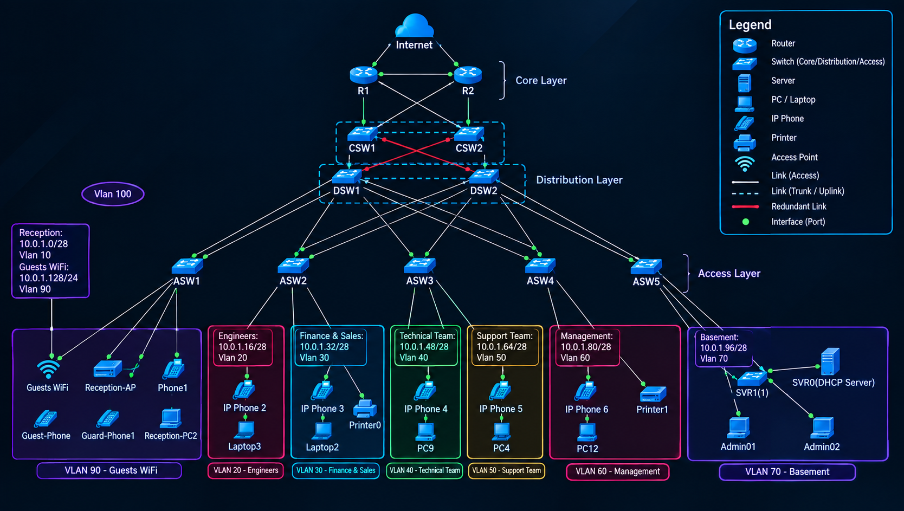
## Table of Contents

1. [Overview](#overview)
2. [Skills-Demonstrated](#Skills-Demonstrated)
3. [Topology](#topology)
4. [VLAN Design](#vlan-design)
5. [IP Addressing](#ip-addressing)
6. [Connectivity Table](#connectivity-table)
7. [Design Decisions](#design-decisions)
8. [Services Implemented](#services-implemented)
9. [Security Hardening](#security-hardening)
10. [Verification Evidence](#verification-evidence)
11. [Problems & Troubleshooting](#problems--troubleshooting)
12. [Known Simulator Limitations](#known-simulator-limitations)
13. [Future Work](#future-work)

---

## Overview

This lab simulates a small company's network, built with a standard **3-tier hierarchical model** (Core – Distribution – Access). Each access switch represents a floor, and each department is isolated on its own VLAN regardless of physical location. The design emphasizes:

- **Redundancy at every layer** (dual routers, dual core switches, dual distribution switches, dual-homed access switches)
- **Realistic segmentation** (7 department VLANs + Guest WiFi + Voice + Management)
- **Dynamic routing** (OSPF) with automatic failover
- **Full network services** (DHCP, DNS, Voice/CME, NTP, Syslog)
- **Defense-in-depth security** (port security, ACLs, SSH-only management, restricted admin access)

---
## Skills Demonstrated

**Network Design & Architecture**
3-Tier Hierarchical Design (Core/Distribution/Access) · VLSM Subnetting · Structured IP Addressing Scheme · Redundant Topology Design

**Switching**
VLANs & Trunking (802.1Q) · Inter-VLAN Routing (SVIs) · EtherChannel (LACP) · Spanning-Tree (PVST+, Root Bridge Placement) · PortFast & BPDU Guard · Port Security

**Routing**
OSPF (Single-Area, Passive Interfaces, Route Redistribution) · HSRP (Active/Standby Load Balancing) · Static & Default Routing · ECMP

**Network Services**
DHCP (Centralized + Relay/`ip helper-address`) · DNS · NTP (Redundant Masters) · Syslog Centralized Logging · Voice/VoIP (Cisco CME, IP Telephony)

**Security**
ACLs (Standard/Extended) · SSH & Local AAA · VLAN Segmentation for Guest Isolation · Dedicated Management VLAN · Trunk Hardening (Native VLAN, DTP Disable)

**Troubleshooting & Diagnostics**
Systematic Layer 1–3 Troubleshooting · `show`/`debug` Command Analysis · Root-Cause Diagnosis of 20+ Real Configuration Issues

**Documentation**
Network Diagramming · IP Address Management (IPAM) Tables · Technical README Authoring · Design Decision Justification.

---

## Topology

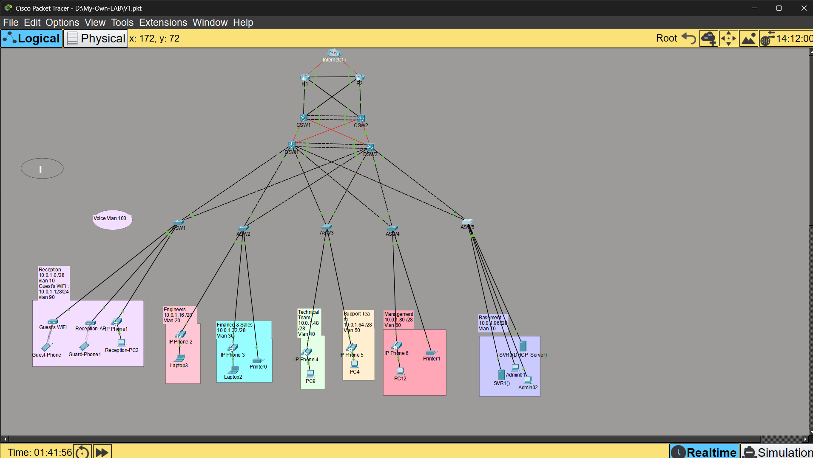

- **Core (CSW1/CSW2):** aggregation point, full-mesh redundant links to both routers and both distribution switches.
- **Distribution (DSW1/DSW2):** Inter-VLAN routing (SVIs), HSRP gateway redundancy, STP root, DHCP relay.
- **Access (ASW1–ASW5):** Layer 2 only (Catalyst 2960 — no routing capability), dual-homed to both distribution switches.

---

## VLAN Design

| VLAN ID | Name | Description | Subnet |
|---|---|---|---|
| 10 | Reception | Reception desk, guest WiFi AP, guard phone, reception PC/phone | 10.0.1.0/28 |
| 20 | Engineers | Engineering team devices (laptop, phone) | 10.0.1.16/28 |
| 30 | Finance_Sales | Finance & Sales department (laptop, phone, printer) | 10.0.1.32/28 |
| 40 | Technical_Team | Technical team workstation and phone | 10.0.1.48/28 |
| 50 | Support_Team | Support team workstation and phone | 10.0.1.64/28 |
| 60 | Management | Management staff, PC, printer, internal access point | 10.0.1.80/28 |
| 70 | Servers | Basement — DHCP/File Server, Security Management Server, Syslog Server | 10.0.1.96/28 |
| 90 | Guest_WiFi | Isolated guest network — internet-only access | 10.0.1.128/28 |
| 100 | Voice | All IP phones network-wide (spans every access switch) | 10.0.1.112/28 |
| 900 | Management_Net | Network device management (SSH/NTP/Syslog source for switches/routers) | 10.0.1.144/28 |
| 999 | Native | Unused native VLAN on all trunks (security best practice) | — |

**Why VLANs are department-based, not floor-based:** VLANs are a *logical* segmentation independent of physical location. Multiple departments can share the same access switch (and do — e.g., ASW2 carries both Engineers and Finance_Sales), each isolated by VLAN. The "one access switch per floor" decision is a *physical cabling* constraint (structured cabling / 100m copper limit), completely independent of VLAN design.

---

## IP Addressing

### WAN / ISP
| Device | Interface | IP Address | Mask | Connected To |
|---|---|---|---|---|
| ISPA | Gi0/0/0 | 8.8.8.9 | /30 | R1 Gi0/3/0 |
| ISPA | Gi0/1/0 | 1.1.1.1 | /30 | R2 Gi0/3/0 |
| R1 | Gi0/3/0 | 8.8.8.10 | /30 | ISPA Gi0/0/0 |
| R2 | Gi0/3/0 | 1.1.1.2 | /30 | ISPA Gi0/1/0 |
| Web Server | Fa0 | 8.8.8.14 | /30 | ISPA Gi0/0 |

### Router ↔ Core
| Device | Interface | IP Address | Mask | Connected To |
|---|---|---|---|---|
| R1 | Gi0/0 | 10.0.2.5 | /30 | CSW1 Gi1/0/3 |
| R1 | Gi0/1 | 10.0.2.9 | /30 | CSW2 Gi1/0/3 |
| R1 | Gi0/2 | 10.0.2.1 | /30 | R2 Gi0/2 |
| R2 | Gi0/0 | 10.0.2.13 | /30 | CSW1 Gi1/0/4 |
| R2 | Gi0/1 | 10.0.2.17 | /30 | CSW2 Gi1/0/4 |
| R2 | Gi0/2 | 10.0.2.2 | /30 | R1 Gi0/2 |
| CSW1 | Gi1/0/3 | 10.0.2.6 | /30 | R1 Gi0/0 |
| CSW1 | Gi1/0/4 | 10.0.2.14 | /30 | R2 Gi0/0 |
| CSW2 | Gi1/0/3 | 10.0.2.10 | /30 | R1 Gi0/1 |
| CSW2 | Gi1/0/4 | 10.0.2.18 | /30 | R2 Gi0/1 |

### Core ↔ Core / Core ↔ Distribution
| Device | Interface | IP Address | Mask | Connected To |
|---|---|---|---|---|
| CSW1 | Port-channel1 | 10.0.2.21 | /30 | CSW2 Port-channel1 |
| CSW2 | Port-channel1 | 10.0.2.22 | /30 | CSW1 Port-channel1 |
| CSW1 | Gi1/1/1 | 10.0.2.25 | /30 | DSW1 Gi1/1/2 |
| DSW1 | Gi1/1/2 | 10.0.2.26 | /30 | CSW1 Gi1/1/1 |
| CSW1 | Gi1/1/2 | 10.0.2.29 | /30 | DSW2 Gi1/1/1 |
| DSW2 | Gi1/1/1 | 10.0.2.30 | /30 | CSW1 Gi1/1/2 |
| CSW2 | Gi1/1/1 | 10.0.2.33 | /30 | DSW1 Gi1/1/1 |
| DSW1 | Gi1/1/1 | 10.0.2.34 | /30 | CSW2 Gi1/1/1 |
| CSW2 | Gi1/1/2 | 10.0.2.37 | /30 | DSW2 Gi1/1/2 |
| DSW2 | Gi1/1/2 | 10.0.2.38 | /30 | CSW2 Gi1/1/2 |

### Distribution ↔ Distribution
| Device | Interface | IP Address | Mask | Connected To |
|---|---|---|---|---|
| DSW1 | Port-channel2 | 10.0.2.41 | /30 | DSW2 Port-channel2 |
| DSW2 | Port-channel2 | 10.0.2.42 | /30 | DSW1 Port-channel2 |

**Design note:** the DSW1↔DSW2 link is a routed Point-to-Point link (not a trunk). This keeps it entirely outside STP's blocking calculations and dedicated to inter-VLAN routing traffic, since STP/HSRP redundancy between DSW1 and DSW2 is already provided by the 5 dual-homed access switch uplinks.

### SVI / HSRP (per VLAN, on DSW1 & DSW2)

| VLAN | DSW1 (Physical) | DSW2 (Physical) | Virtual IP (Gateway) | STP Root / HSRP Active |
|---|---|---|---|---|
| 10 | 10.0.1.3 | 10.0.1.4 | 10.0.1.1 | DSW2 |
| 20 | 10.0.1.19 | 10.0.1.20 | 10.0.1.17 | DSW2 |
| 30 | 10.0.1.35 | 10.0.1.36 | 10.0.1.33 | DSW2 |
| 40 | 10.0.1.51 | 10.0.1.52 | 10.0.1.49 | DSW1 |
| 50 | 10.0.1.67 | 10.0.1.68 | 10.0.1.65 | DSW1 |
| 60 | 10.0.1.83 | 10.0.1.84 | 10.0.1.81 | DSW1 |
| 70 | 10.0.1.99 | 10.0.1.100 | 10.0.1.97 | DSW1 |
| 90 | 10.0.1.131 | 10.0.1.132 | 10.0.1.129 | DSW1 |
| 100 | 10.0.1.115 | 10.0.1.116 | 10.0.1.113 | DSW2 |
| 900 | 10.0.1.147 | 10.0.1.148 | 10.0.1.145 | DSW1 |

**Load balancing:** STP root and HSRP active roles are intentionally split between DSW1 and DSW2 (and kept *consistent* with each other) to distribute traffic load and avoid suboptimal forwarding paths.

### Access Switch Management IPs (VLAN 900)
| Device | IP Address | Default Gateway |
|---|---|---|
| ASW1 | 10.0.1.151 | 10.0.1.145 |
| ASW2 | 10.0.1.152 | 10.0.1.145 |
| ASW3 | 10.0.1.153 | 10.0.1.145 |
| ASW4 | 10.0.1.154 | 10.0.1.145 |
| ASW5 | 10.0.1.155 | 10.0.1.145 |
| Admin-PC 01 | 10.0.1.157 | 10.0.1.145 |
| Admin-PC 02 | 10.0.1.156 | 10.0.1.145 |

### Servers (VLAN 70)
| Server | IP Address | Role |
|---|---|---|
| SVR0 | 10.0.1.98 | DHCP/DNS Server |
| SVR1 | 10.0.1.101 | Syslog Server |
| Security Mgmt Server | (VLAN 70) | Security management |

### Router IDs (Loopback0)
| Device | Loopback0 |
|---|---|
| R1 | 10.255.255.1 |
| R2 | 2.2.2.2 |
| CSW1 | 3.3.3.3 |
| CSW2 | 4.4.4.4 |
| DSW1 | 5.5.5.5 |
| DSW2 | 6.6.6.6 |

---

## Connectivity Table

| Device | Local Interface | Connected Device : Interface |
|---|---|---|
| R1 | Gi0/0 / Gi0/1 / Gi0/2 / Gi0/3/0 | CSW1 Gi1/0/3, CSW2 Gi1/0/3, R2 Gi0/2, ISPA Gi0/0/0 |
| R2 | Gi0/0 / Gi0/1 / Gi0/2 / Gi0/3/0 | CSW1 Gi1/0/4, CSW2 Gi1/0/4, R1 Gi0/2, ISPA Gi0/1/0 |
| CSW1 | Gi1/0/1-2, Gi1/0/3-4, Gi1/1/1-2 | CSW2 (Po1), R1, R2, DSW1, DSW2 |
| CSW2 | Gi1/0/1-2, Gi1/0/3-4, Gi1/1/1-2 | CSW1 (Po1), R1, R2, DSW1, DSW2 |
| DSW1 | Gi1/0/1-5, Gi1/1/1-2, Po2 | ASW1-5, CSW1, CSW2, DSW2 |
| DSW2 | Gi1/0/1-5, Gi1/1/1-2, Po2 | ASW1-5, CSW1, CSW2, DSW1 |
| ASW1 | Gig0/1-2, Fa0/1-3 | DSW1, DSW2, IP Phone1, Reception-AP, Guest WiFi |
| ASW2 | Gig0/1-2, Fa0/1-3 | DSW1, DSW2, IP Phone2/3, Printer0 |
| ASW3 | Gig0/1-2, Fa0/1-4 | DSW1, DSW2, IP Phone4/5 |
| ASW4 | Gig0/1-2, Fa0/1-2 | DSW1, DSW2, IP Phone6, Printer1 |
| ASW5 | Gig0/1-2, Fa0/1-3 | DSW1, DSW2, SVR0, SVR1, Admin-PC |

*(Full per-port detail available in the project's internal documentation.)*

---

## Design Decisions

- **3-tier vs. Collapsed Core:** a true 3-tier model was used (rather than merging Core into Distribution) to demonstrate the classic hierarchical model and to keep the design ready to scale to a second Distribution Block (e.g., a second building) aggregated at the same Core — which is exactly this lab's planned next phase.
- **Trunk+SVI vs. Routed Access:** Access switches (Catalyst 2960) are Layer 2 only and cannot run inter-VLAN routing — this makes Trunk+SVI the only technically viable design, in addition to being more flexible (a VLAN can span multiple access switches) and cheaper (no need for L3 switches at every closet).
- **DSW1↔DSW2 as a routed link, not a trunk:** keeps that link fully outside STP calculations, dedicated to routing traffic; L2 redundancy for STP/HSRP hellos is already provided via the 5 dual-homed access switch uplinks.
- **Voice VLAN as a single VLAN spanning the whole network:** unlike department VLANs (isolated per department), voice traffic needs uniform reachability company-wide for call signaling.
- **Dedicated Management VLAN (900), physically located in the server room (Basement/ASW5):** device management traffic (SSH/NTP/Syslog) is isolated from user traffic, and the admin workstation is placed in a physically-restricted area, not among general staff — applying defense-in-depth even though VLAN isolation alone would suffice logically.
- **DHCP Relay (`ip helper-address`) instead of per-VLAN DHCP servers:** a single centralized DHCP server, reachable via relay on every SVI, avoids duplicating server infrastructure per VLAN.
- **Guest WiFi ACL vs. Management ACL — different enforcement points:** the Guest isolation ACL applies on the VLAN 90 SVI (`ip access-group ... in`) because it must control general IP traffic entering the network. The management-access restriction applies on the VTY lines (`access-class ... in`) because it specifically governs remote administrative sessions, not general traffic.
- **OSPF Single-Area (Area 0):** the network's single Distribution Block does not justify Multi-Area complexity; the design is ready to introduce new areas per future Distribution Block (e.g., Building 2).
- **Dedicated Loopback0 addressing scheme (10.255.255.x) for router IDs:** kept fully separate from any real subnet in use, after an early addressing conflict (see Problems table) taught the importance of this separation.

---

## Services Implemented

- **DHCP:** centralized pool-based DHCP (SVR0) for every user VLAN, delivered via `ip helper-address` relay.
- **DNS:** internal DNS on SVR0, resolving `google.com` → the lab's own simulated "internet" web server (8.8.8.14), demonstrating full DHCP→DNS→Routing→HTTP integration end-to-end.
- **HTTP:** simulated external web server behind ISPA, serving a mock landing page.
- **Voice (CME):** Cisco CallManager Express on R2, with 6+ registered IP phones, each with a unique extension (1001–1006+), DHCP Option 150 for TFTP-based auto-provisioning.
- **NTP:** R1 and R2 configured as dual, equal-stratum NTP masters; all other devices sync from both for redundancy.
- **Syslog:** centralized logging to a dedicated Syslog server (SVR1), with timestamped, timezone-aware log entries from every device.
- **OSPF dynamic routing** with ECMP (equal-cost multi-path) load balancing and automatic default-route propagation from the dual edge routers.

---

## Security Hardening

- **Port Security:** sticky MAC learning, per-port maximum, `violation restrict` (end-user ports) or `violation shutdown` (server ports), on every access port.
- **STP protections:** PortFast + BPDU Guard on every end-device port; STP root explicitly assigned (never left to election) and split across DSW1/DSW2 for load balancing.
- **Guest WiFi isolation:** dedicated VLAN (90) restricted by ACL to internet-only access (DHCP explicitly permitted, all internal subnets explicitly denied).
- **Dedicated Management VLAN (900):** isolates device administration traffic (SSH/NTP/Syslog) from user data, with the admin workstation physically located in the restricted server room.
- **SSH + Local AAA on every device:** Telnet disabled entirely (`transport input ssh`), local username/secret authentication (`login local`), MD5-hashed secrets, session timeout, and a warning banner.
- **Restricted administrative access (ACL on VTY):** SSH connections are only accepted from within the Management VLAN (10.0.1.144/28); all other sources are denied at the VTY line level, even with valid credentials.
- **Trunk security:** non-default native VLAN (999, unused/isolated) on every trunk, `switchport nonegotiate` to disable DTP.

---

## Verification Evidence

*(Screenshots referenced here are included in the `/evidence` folder of this repository.)*

1. **End-to-end connectivity:** successful ping from Reception-PC2 (VLAN 10) to a simulated WAN address, confirming the full path PC → DSW → CSW → Router → ISP.
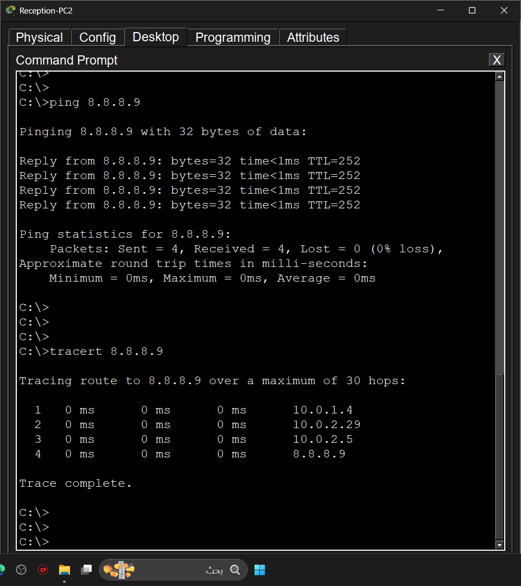

2. **HSRP redundancy:** `show standby brief` on DSW1 and DSW2 confirms correct Active/Standby distribution matching the design table above.
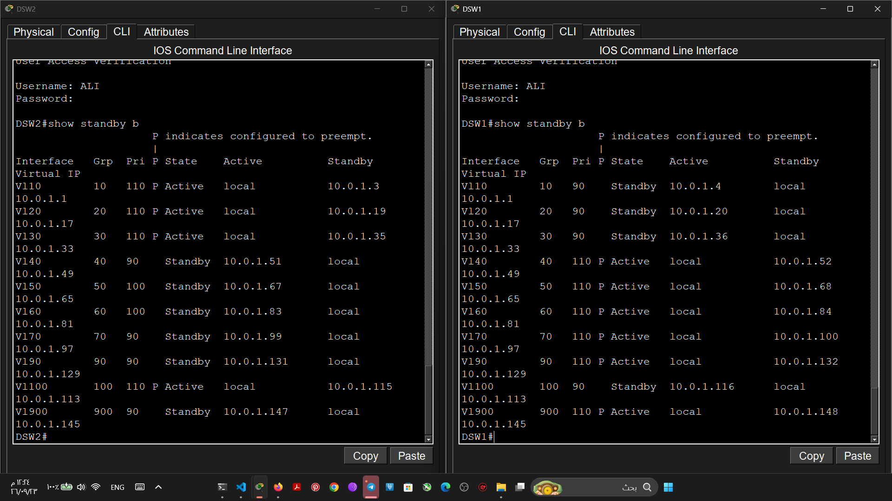

3. **OSPF + ECMP:** `show ip route` on DSW1 shows dual equal-cost paths (via CSW1 and CSW2) for most destinations, including the default route.
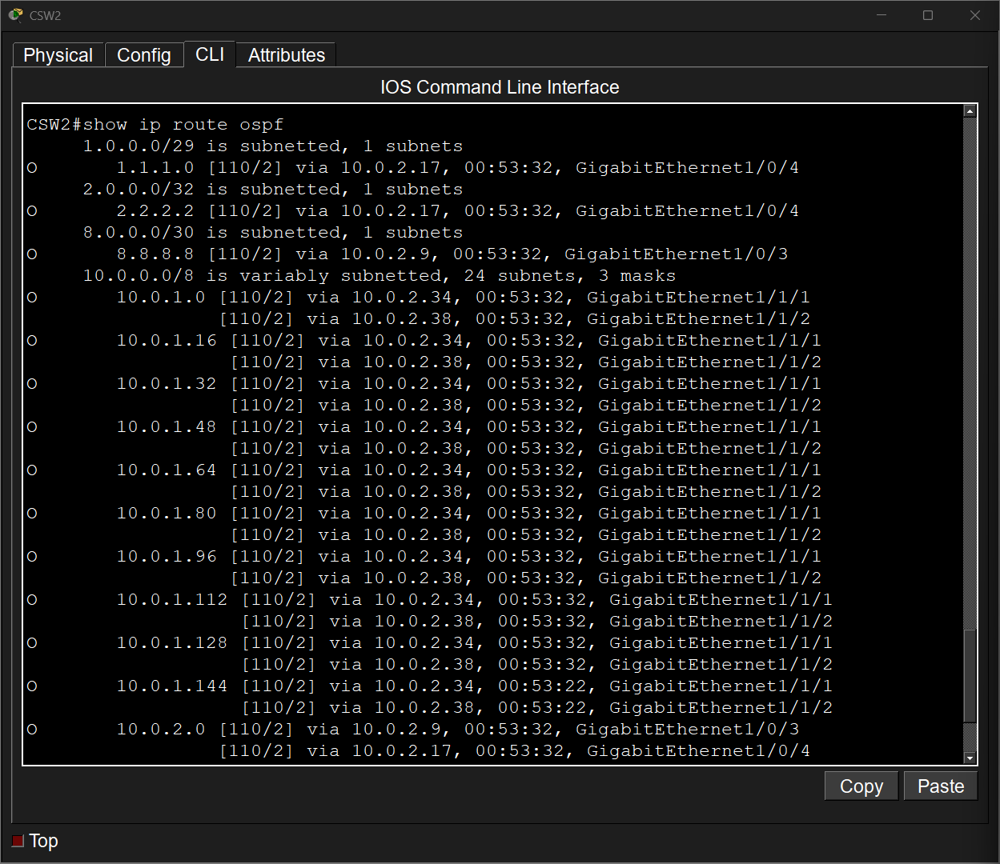 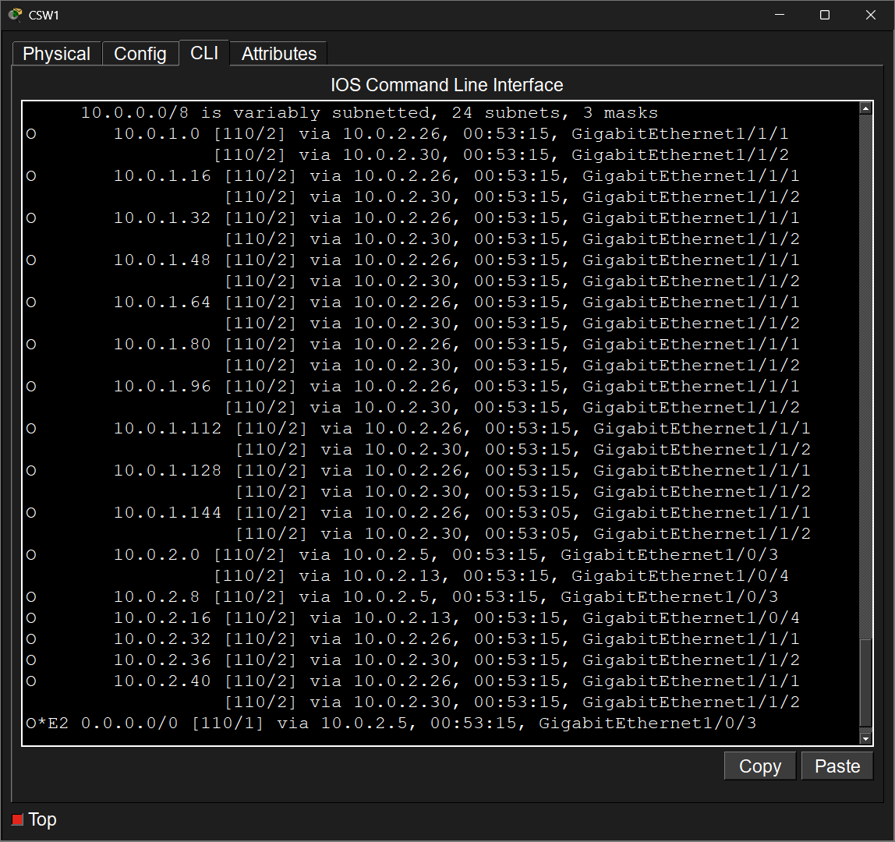

4. **Voice registration:** `show ephone registered` confirms all IP phones registered with their correct, unique extensions.
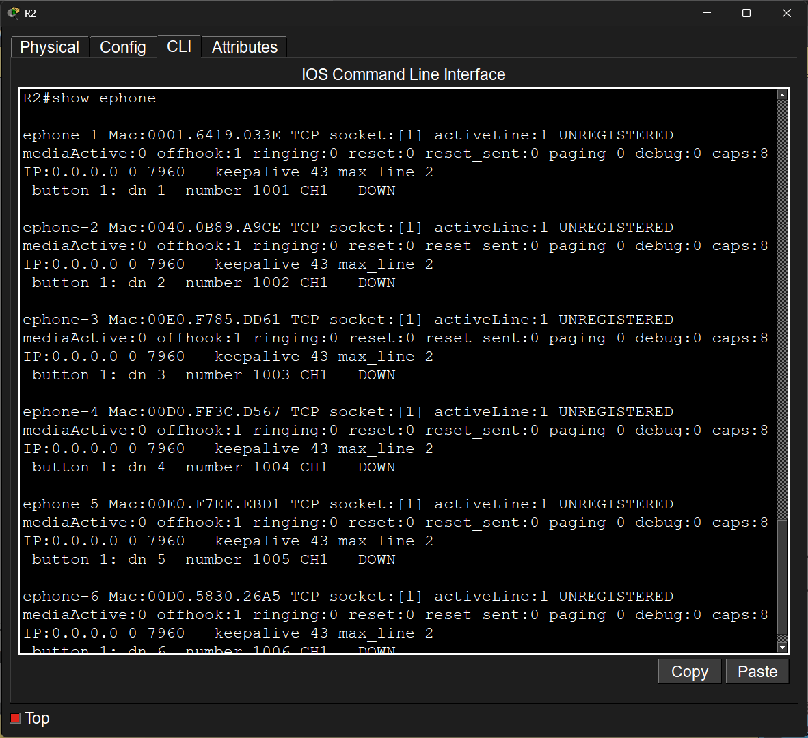
5. **Guest WiFi isolation:** ping from the Guest WiFi VLAN to an internal subnet returns "Destination host unreachable" (explicit ACL deny), while ping to the simulated internet succeeds.
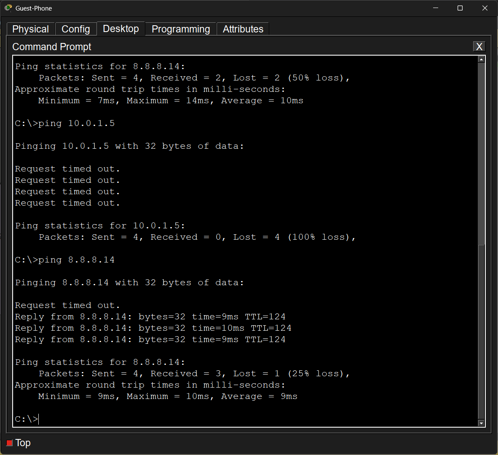

6. **Syslog:** timestamped log entries received on SVR1 from multiple devices, confirming NTP-synchronized, accurate logging.
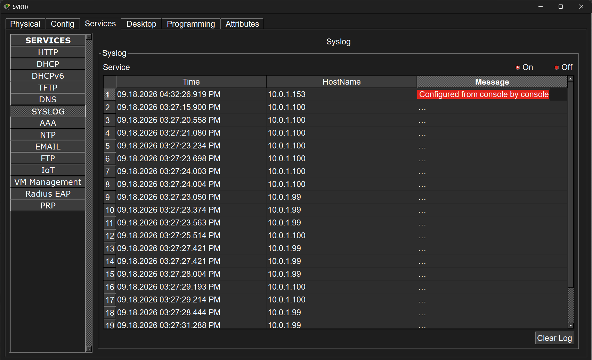

7. **SSH management:** successful SSH sessions with any Net-device from only Admin PCs (SSH is controled by an ACL to deney SSH-access from random PCs even from inside the network ), each displaying the security banner and landing directly in privileged EXEC mode.
- From an allowed pc (ADMIN01)
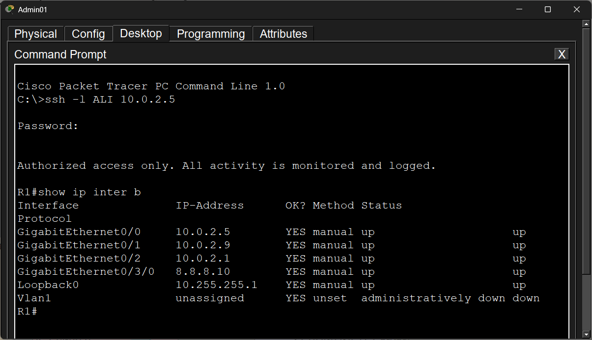

- From any other device inside the network  
  
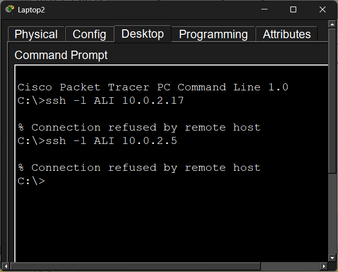

8. **DNS + HTTP:** a browser on an internal PC successfully resolves `google.com` via the internal DNS server and loads the simulated web page — full application-layer verification of the entire network stack.
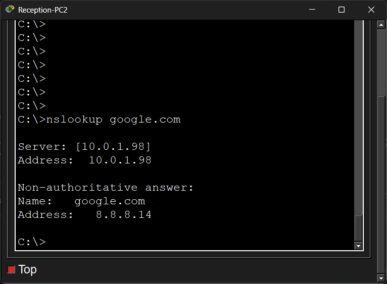 

---

## Problems & Troubleshooting

This section documents real issues encountered during the build and how each was diagnosed and resolved — the diagnostic process is arguably the most valuable part of this project.

| # | Problem | Root Cause | Resolution |
|---|---|---|---|
| 1 | VLAN subnetting arithmetic error | Incremented by 17 instead of 16 per block | Corrected block-size math (block size = 2^host-bits, always a clean multiple) |
| 2 | Internet cloud not connected to edge router | Initial diagram oversight | Connected cloud + added a second (backup) router |
| 3 | Repeated "bad mask" errors when assigning IPs | Assigning the Network ID instead of a usable host address | Checked: does the last octet divide evenly by the block size? |
| 4 | WAN link addressing conflict (private IPs on a P2P WAN link) | Misapplied "private vs. public" thinking to a point-to-point link | Both ends of any P2P link must share the same subnet, regardless of address type |
| 5 | DSW1 missing an entire link to CSW2 | Two interface IPs were swapped | Cross-checked against the actual connectivity table and corrected addresses |
| 6 | EtherChannel between CSW1–CSW2 down despite member ports being up | Likely `channel-group` mode mismatch | Verified with `show etherchannel summary`; aligned modes on both ends |
| 7 | Core↔Distribution fiber links down | Multi-mode fiber used with single-mode-only SFP transceivers | Matched fiber type to transceiver type |
| 8 | VLANs missing from local switch database | `allowed vlan` configured on trunk without first creating the VLAN locally | Added `vlan <id> / name <name>` on every switch before trunking |
| 9 | `bpdufilter` mistakenly used instead of `bpduguard` | Misunderstanding: filter silently disables STP awareness (both directions) rather than protecting the port | Removed `bpdufilter`; kept `bpduguard` only |
| 10 | Port-security violations despite correct-looking config | Stale sticky MAC addresses from earlier testing no longer matched the connected device | Cleared old sticky entries, allowed re-learning |
| 11 | STP Root and HSRP Active assigned inconsistently | Two separate decisions made without cross-referencing each other | Unified the split (same switch = both Root and Active per VLAN group) |
| 12 | Loopback0 IP conflict on R1 | WAN link was widened to a /29, which absorbed the Loopback's /32 address | Moved all router-id Loopbacks to a dedicated, unused range (10.255.255.x) |
| 13 | `switchport port-security maximum X vlan access/voice` rejected | Unsupported command on this Packet Tracer IOS image | Reverted to a single combined `maximum` value |
| 14 | Access switches completely unreachable for NTP/SSH/Syslog | No IP address existed anywhere on the switches (default VLAN 1 shut down) | Built a dedicated Management VLAN (900) with an SVI + `ip default-gateway` on every access switch |
| 15 | Massive NTP time offset (~28 seconds) between routers | R1 and R2 clocks were set manually several minutes apart | Re-set both clocks manually within seconds of each other |
| 16 | NTP peer stuck in `.INIT.` via Loopback address despite working routing | `ntp source` command unsupported in this Packet Tracer IOS image | Used the physical interface address as the NTP peer instead of the Loopback |
| 17 | `logging trap informational` rejected | Simulator only supports `debugging` severity for this command | Used `debugging` and documented the limitation |
| 18 | `logging source-interface vlan900` command not recognized | Unsupported command on this platform/model | Documented as a simulator limitation; logs appear sourced from the actual egress interface instead |
| 19 | Temporary OSPF/HSRP flapping after adding VLAN 900 | New SVI wasn't yet marked passive for OSPF | Added `passive-interface vlan900`; allowed convergence time |
| 20 | All IP phones registered with the same extension (1001) | Every `ephone` was configured with `button 1:1` instead of a unique DN mapping | Corrected each `button` mapping to match its own `ephone-dn` |
| 21 | `telephony-service` command rejected on R2 | Voice/UC feature package not licensed on the image | `license boot module c2900 technology-package uc` + reload |
| 22 | HTTP page returned "File Not Found" | Web page file was named `google.com.html` instead of `index.html` (the default document name the server looks for) | Renamed file to `index.html` |

---

## Known Simulator Limitations

Several commands behave differently — or aren't supported at all — in this Packet Tracer IOS image compared to real Cisco hardware. These are documented explicitly rather than worked around silently, since knowing the "correct" real-world approach matters as much as knowing the workaround:

- `logging trap` only accepts `debugging` (severity 7) as an explicit level — real IOS supports the full 0–7 range.
- `logging source-interface` is not a recognized command on this platform — real IOS would use this to set a consistent syslog source address (e.g., a Loopback) regardless of egress path.
- `ntp source` is not supported — real IOS would use this to pin NTP traffic to a specific (typically Loopback) source interface for consistency and redundancy.
- `switchport port-security maximum <n> vlan {access|voice}` (per-VLAN maximum on a single port) is not supported — real IOS supports separately limiting data and voice VLAN MAC counts on the same port.
- Reverse DNS (PTR records) for Syslog source resolution is not supported by the simulator's DNS service — real deployments would resolve logged source IPs to hostnames automatically.

---

## Future Work

- **Second Distribution Block ("Building 2"):** duplicate the current topology, connected to the same Core switches, with renumbered VLANs (110–200) and subnets (10.0.3.0/24 users, 10.0.4.0/24 infrastructure) — demonstrating the Core layer's real purpose as a multi-block aggregation point.
- **Failover demonstration:** live documentation (continuous ping + before/after screenshots) of automatic recovery when a Distribution switch or Core link is deliberately taken down.
- **`switchport protected`** on server-room ports (DHCP server, Security server, Admin-PC) to prevent direct Layer-2 communication between sensitive hosts on the same switch — a protection ACLs alone cannot provide.
- Dynamic routing between Distribution and Core via OSPF multi-area, once a second Distribution Block is added.
